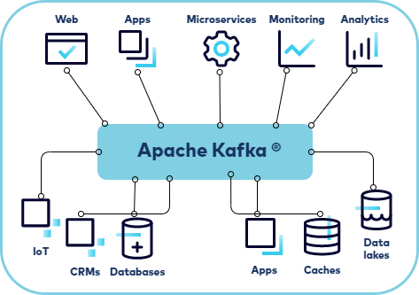

## What are Kafka characteristic?

1. **Horizontal Scalability and High Availability**  
 Achieved through partitioning and replication mechanisms.
   
2. **Data Consistency**: Ensured by using a log mechanism for data persistence and replication.
   
3. **Separation of Data Storage and Consumption**: Producers generate data while consumers read and process data independently, enhancing system flexibility.

4. **Decoupling Producers and Consumers**: Producers send data to Kafka without worrying about the consumers. Consumers pull data from Kafka as needed, known as the pull model, which decouples the dependency between the two and increases system flexibility.

## Kafka is Pull Model

Kafka uses a pull model for data consumption, which means that consumers actively request data from Kafka rather than Kafka pushing data to consumers.

> **Imagine if Kafka were to use a push model where machines send tens of thousands of data to Kafka and Kafka immediately forwards it to consumers,    
the consumers' computers would likely crash due to performance issues throughout the day.**

### How the Pull Model Works

1. Producers generate data and send it to Kafka topics. They do not need to know how or when this data will be consumed.
   
2. Consumers subscribe to Kafka topics and pull data from these topics as needed. They send requests to Kafka brokers, asking for new records from specific partitions.

### Benefits of the Pull Model

1. **Consumer-Controlled Flow**: Consumers control the rate at which they consume data. They can pull data at their own pace, which helps in managing and balancing load.
   
2. **Efficient Resource Utilization**: By pulling data, consumers can ensure they are ready to process the data, avoiding potential overload or resource contention.

3. **Flexibility in Processing**: Consumers can decide how much data to pull and process in each request, allowing them to adapt to varying workloads and processing capabilities.

4. **Improved Fault Tolerance**: In a pull model, if a consumer fails or needs to restart, it can simply resume pulling data from where it left off, reducing the risk of data loss or duplication.

Using Kafka's pull model, these updates are sent to Kafka topics by the machines (producers). Monitoring systems (consumers) then pull this data at their own pace, processing each update in real-time without being overwhelmed by the volume of data.

## Key Roles in Kafka

### 1. **Broker**
Simply put, a broker is a Kafka node responsible for receiving, storing, and synchronizing data. Each broker not only serves consumers but also communicates with other brokers for data backup, forming a distributed cluster.

### 2. **Topic**
   In Kafka,  topic is like a category where producers send their messages. It acts as a central hub where producers put out data, and consumers sign up to get and use that data.

### 3. **Producer**
   Producers are responsible for continuously sending data to Kafka topics, with each piece of data considered a record. Producers can be various applications, such as monitoring systems, web server logs, or real-time data from factory machines.

### 4. **Consumer**
   Consumers can pull "message" at their own pace. They can operate independently or as part of a consumer group, dividing consumption tasks among the group members based on partitions.

Conceptual diagram:

