不同於Paxos，Raft使用Leader(領導者)、Follower(追隨者)等更直觀的術語
並且簡化了複雜的流程，主要有三個流程：

1. **Leader Election 領導者選舉**
2. **Log Replication 日誌複製**
3. **Log Consistency 日誌一致性**

在Raft中，有以下三個角色代表不同節點：
1. Follower
2. Candidate
3. Leader

## 1. Leader Election

1. **初始化狀態**
   - 系統中的所有節點開始時都處於Follower狀態。 
   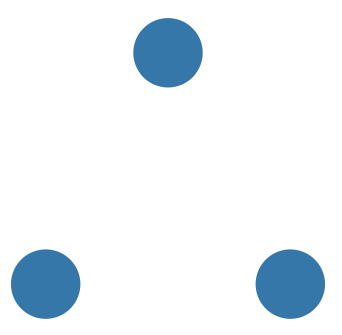	   

2. **超時觸發選舉**
   - 每個Follower節點在一定時間內沒有收到來自Leader的心跳訊號(Heartbeat)，它會轉變為Candidate並發起選舉。
   - 以下舉例為節點初始化時的狀態(沒任何Leader 傳 heaerbeat)，每個節點的進度條則代表沒收到心跳訊號的時間
   <!-- 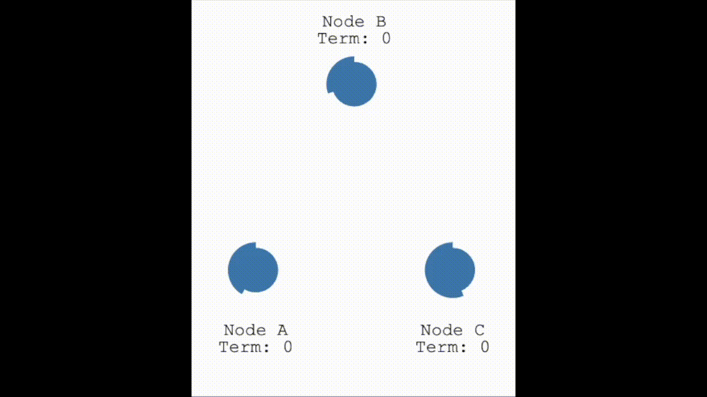

3. **發送投票請求**
   - Candidate節點向其他所有節點發送RequestVote請求，並附帶其當前的日誌索引和任期號。 
   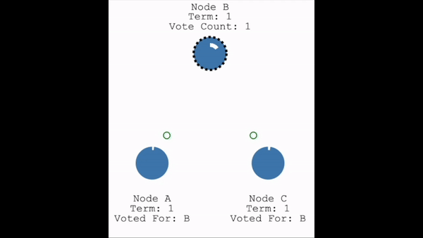

4. **接受投票**
   - 其他節點（Followers）收到RequestVote請求後，會根據Candidate的日誌索引和任期號決定是否投票。
   - 如果該Candidate的日誌比自己更新，且尚未投票給其他Candidate，則會投票給該Candidate(這裡算是算法的核心之一)。
   - 像上面gif顯示的結尾部分，Candidate變成Leader。

5. **當選為Leader**
   - Candidate節點如果獲得多數節點的投票（超過半數），則成為Leader。
   - 當選後，它會立即向其他節點發送心跳訊號，通知其成為新的Leader，以下為正常Leader持續傳送心跳訊號的樣子。
   <!-- 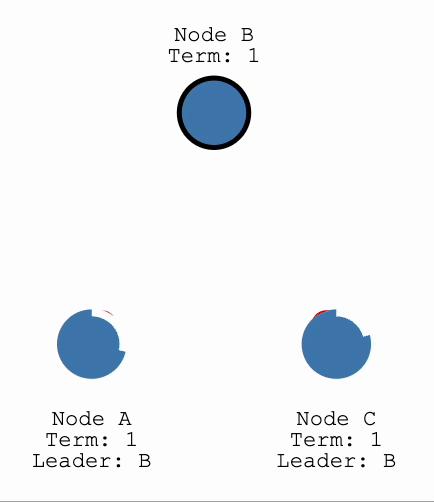 -->

6. **處理失敗情況**
   - 如果Candidate在一定時間內沒有獲得足夠的投票，它會重新進入Follower狀態，並等待下一次選舉超時再次發起選舉。
   - 以下是當Leader掛掉 不再傳送心跳訊號時，各節點會再重新選出新Leader的選舉機制（意義上就是回到 **1.初始化狀態** 開始）
   <!-- 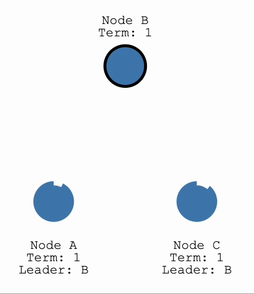 -->

> 以下影片為多節點觸發投票機制的情況	


## 2. Log Replication 日誌複製

當有了領導者之後，一旦系統有發生改變時，我們就需要將系統的所有變更複製到所有節點。

1. **日誌條目追加**
   - 當 Leader 接收到一個新的數據變更請求(例如,增加一筆資料),它會將該變更記錄為一個新的日誌條目,並將其追加到其本地日誌中。
   - 以下例子 (綠色節點=Client) 是Client 傳一筆資料 = 5 的資料給 Leader 
   <!-- 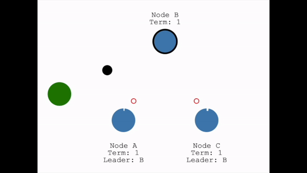 -->

2. **發送 AppendEntries 請求**
   - Leader 會並行地將新的日誌條目發送給所有 Follower 節點,通過發送 AppendEntries RPC 請求。每個 Follower 在收到 AppendEntries 請求後,會將新的日誌條目附加到其本地日誌中。
   <!-- 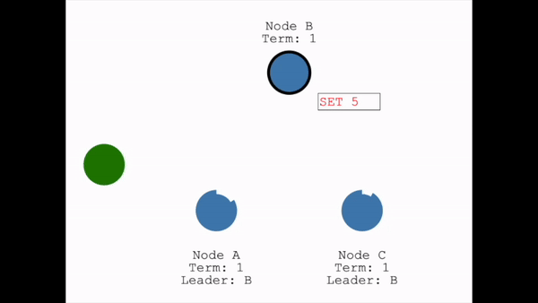 -->

3. **回覆成功或失敗**
   - Follower 處理完 AppendEntries 請求後,會向 Leader 回覆是否成功附加了新的日誌條目。
   - 如果大多數(>50%)Follower 成功複製了日誌條目，則該條目被認為已經被提交。

4. **應用日誌條目**
   - 一旦某個日誌條目被提交,Leader 會通知所有 Follower 應用該條目到狀態機器(State Machine)中。這樣,所有節點的數據狀態就保持一致。
   <!-- 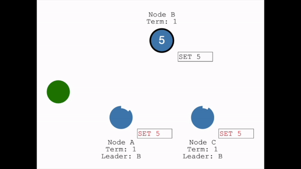 -->
      
5. **處理網絡分區**
   - Raft 甚至可以在網路分區時保持一致性。
   - 如果在日誌複製過程中出現網絡分區,導致 Leader 無法與部分 Follower 通信,則 Leader 會無限期等待這些 Follower 重新上線。一旦重新建立連接,Leader 會自動將它們的日誌複製過來。
  
6. **網絡分區案例**
   - 讓我們新增一個分割區來將 A 和 B 與 C、D 和 E 分開例子：
     - 由於我們的分裂，我們現在有兩位不同任期的Leader。
     <!-- 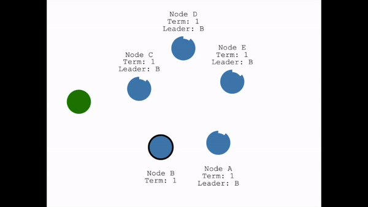 -->
   
   - 我們新增另一個客戶端並嘗試更新兩個Leader的資料。
     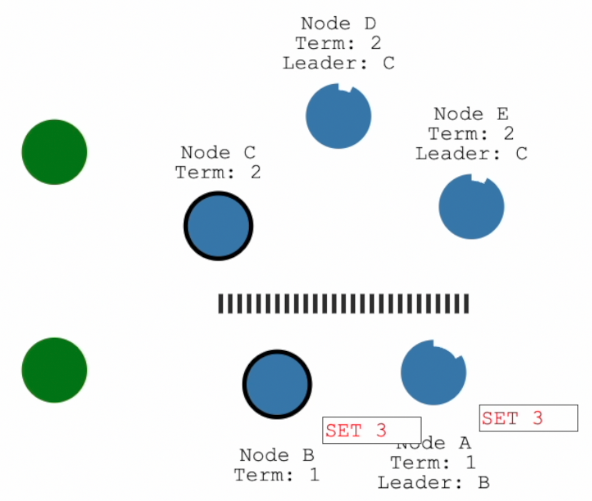

   - 各分區開始各做各的
     - 圖中下面的一個Client端將嘗試將節點 B 的值設為『3』，但由於節點 B 因為節點數量不夠多而無法使選舉機制成功，所以無法複製資料到多數節點，因此其日誌條目一直保持未提交狀態。
     (專注看下面的分區)
     <!-- 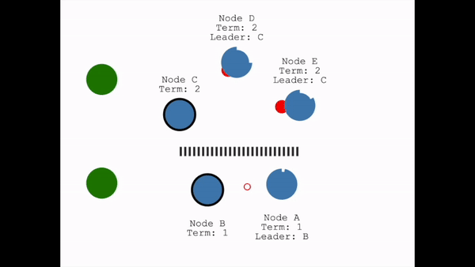 -->
   
     - 再來看上面的Client端分區
     - Client 將嘗試將節點E的值設為“8”，因為結點多到可以使選舉機制成功，所以其他Follwer也會更新。
     (專注看上面的分區)
     <!-- 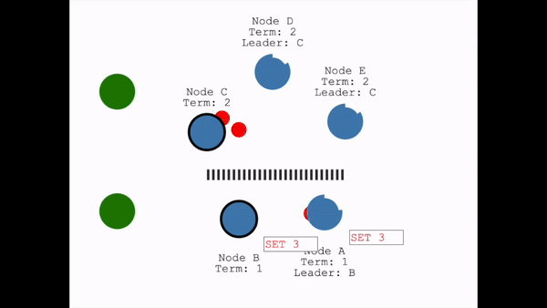 -->
   

7. **修復網路分割區**
   - 當我們修復網路分割區時
     - 節點 B 將會看到更新的『選舉任期』，所以無條件接受別人的資料版本，並接受新領導者的日誌，接著，我們的日誌在整個叢集中就變成是一致的了。
     <!-- 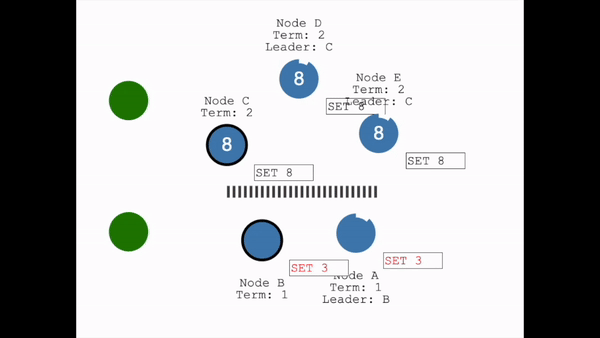 -->

通過以上過程,Raft 確保了在任何時候,大多數節點的日誌都是完全一致的。這樣就保證了系統的數據一致性和容錯性。 -->